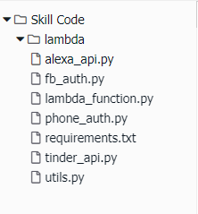

# Build an Alexa-Hosted Skill in Alexa Developer Console

## Setting Up A Lambda Function Using Amazon Web Services

In the [first step of this guide](1-voice-user-interface.md), we built the Voice User Interface (VUI) for our Alexa skill.  On this page, we will be creating a Lambda function using [Amazon Web Services](http://aws.amazon.com). Lambda is where our code lives.  When a user asks Alexa to use our skill, it is our Lambda function that interprets the appropriate interaction, and provides the conversation back to the user.

1.  **Go to the Code navigation pane on the Alexa Developer Console**

2.  **Copy and paste the code found in ``lambda/py`` as new files in this console.**

    

3.  **Click the "Deploy" button.** It should be near the top of your screen.

    

   

