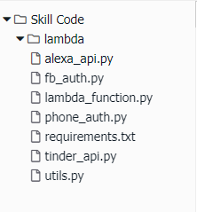

# Build an Alexa-Hosted Skill in Alexa Developer Console

## Setting up Your Alexa Skill in the Developer Console

1.  **Go to the [Alexa Developer Console](https://developer.amazon.com/alexa/console/ask).  In the top-right corner of the screen, click the "Sign In" button.**
(If you don't already have an account, you will be able to create a new one for free.)

1.  From the **Alexa Developer Console** select the **Create Skill** button near the top-right of the list of your Alexa Skills.

1. Give your new skill a **Name**, for example, 'Tinder Voice'. This is the name that will be shown in the Alexa Skills Store, and the name your users will refer to.

1. Select the Default Language.  This tutorial will presume you have selected 'English (US)'.

1. Select the **Custom** model under the *'Choose a model to add to your skill'* section. Select the **Alexa-Hosted (Python)** method under the *'Choose a method to host your skill's backend resources'*. Click the **Create Skill** button at the top right.

1. **Build the Interaction Model for your skill**
	1. On the left hand navigation panel, select the **JSON Editor** tab under **Interaction Model**. In the textfield provided, replace any existing code with the code provided in the [Interaction Model](../models/en-US.json).  Click **Save Model**.
    2. If you want to change the skill invocation name, select the **Invocation** tab. Enter a **Skill Invocation Name**. This is the name that your users will need to say to start your skill.  In this case, it's preconfigured to be 'tinder voice'.
    3. Click "Build Model".

7. **Enable Alexa Presentation Language for your skill**
	1. On the left hand navigation panel, select the **Interface** tab. Enable **Display Interface**
    2. Click "Build Model".

8. **Enable Permissions for your skill**
    1. On the left hand navigation panel, select the **Permissions** tab. Enable **Customer Phone Number**

9. If your interaction model builds successfully, proceed to the next step. If not, you should see an error. Try to resolve the errors. In our next step of this guide, we will be creating our Lambda function.

## Setting Up A Lambda Function Using Amazon Web Services

In the [first step of this guide](1-voice-user-interface.md), we built the Voice User Interface (VUI) for our Alexa skill.  On this page, we will be creating a Lambda function using [Amazon Web Services](http://aws.amazon.com). Lambda is where our code lives.  When a user asks Alexa to use our skill, it is our Lambda function that interprets the appropriate interaction, and provides the conversation back to the user.

1.  **Go to the Code navigation pane on the Alexa Developer Console**

2.  **Copy and paste the code found in ``lambda/py`` as new files in this console.**

    

3.  **Click the "Deploy" button.** It should be near the top of your screen.

    

   
 
## Testing Your Alexa Skill

So far, we have [created a Voice User Interface](./1-voice-user-interface.md) and [a Lambda function](./2-lambda-function.md), and [connected the two together](./3-connect-vui-to-code.md).  Your skill is now ready to test.

1.  **Go back to the [Amazon Developer Portal](https://developer.amazon.com/edw/home.html#/skills/list) and select your skill from the list.** You may still have a browser tab open if you started at the beginning of this tutorial.

2. Open the **Test** Pane, by selecting the **Test** link from the top navigation menu.

3. Enable Testing by activating the **Test is enabled for this skill** slider. It should be underneath the top navigation menu.

4. To validate that your skill is working as expected, invoke your skill from the **Alexa Simulator**. You can either type or click and hold the mic from the input box to use your voice.
	1. **Type** "Open" followed by the invocation name you gave your skill in [Step 1](./1-voice-user-interface.md). For example, "Open tinder voice".
	2. **Use your voice** by clicking and holding the mic on the side panel and saying "Open" followed by the invocation name you gave your skill.
	3. **If you've forgotten the invocation name** for your skill, revisit the **Build** panel on the top navigation menu and select Invocation from the sidebar to review it.

5. Ensure your skill works the way that you designed it to.
	* After you interact with the Alexa Simulator, you should see the Skill I/O **JSON Input** and **JSON Output** boxes get populated with JSON data. You can also view the **Device Log** to trace your steps.
	* If it's not working as expected, you can dig into the JSON to see exactly what Alexa is sending and receiving from the endpoint. If something is broken, AWS Lambda offers an additional testing tool to help you troubleshoot your skill.

6.  **Configure a test event in AWS Lambda.** Now that you are familiar with the **request** and **response** boxes in the Service Simulator, it's important for you to know that you can use your **requests** to directly test your Lambda function every time you update it.  To do this:
    1.  Enter an utterance in the service simulator, and copy the generated Lambda Request for the next step.

    2.  **Open your Lambda function in AWS, open the Actions menu, and select "Configure test events."**

        

8.  **If your sample skill is working properly, you can now customize your skill.**

## Customization / Next Steps

At this point, you should have a working copy of our Hello World skill. 

Normally, if you were building a skill from one of our templates, you would customize it and make it your own (as opposed to a clone of our template).  After that, you would certify and publish the skill.  Given that this is the Hello World skill, you won't be doing that.  Instead, check out some of these other templates which will start to show you more of the features of the Alexa Skills Kit.

